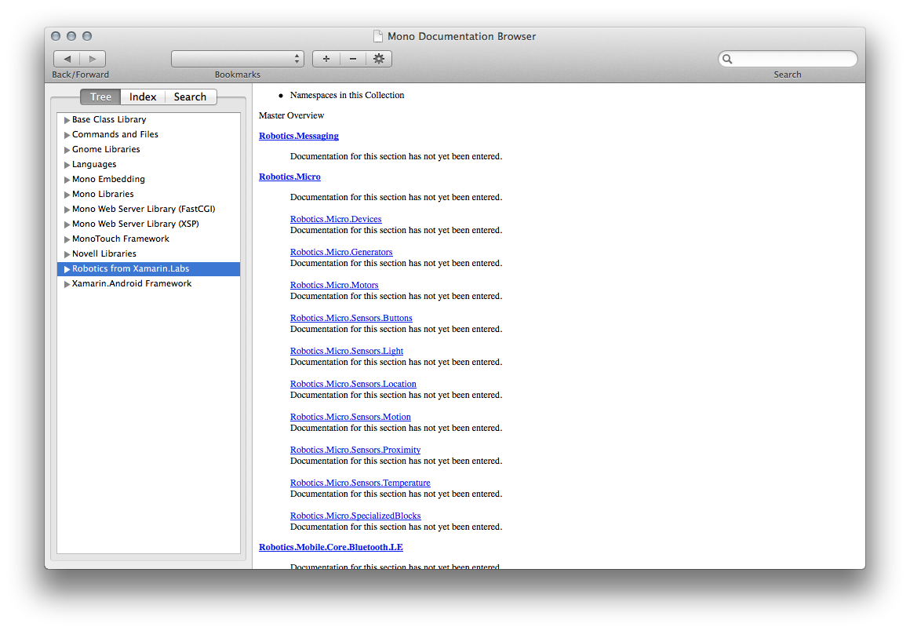

# API Documentation

The docs herein can be viewed in the MonoDoc browser.

## One Time Configuration

In order to have MacDoc know that the doc set exists, you must copy the `Robotics-docs.source` file to `/Library/Frameworks/Mono.Framework/External/monodoc`.	
You can run this from the terminal from this folder by running:

```
sudo cp Robotics-docs.source /Library/Frameworks/Mono.Framework/External/monodoc

```
> Note, It'll prompt you to enter your password.

## Displaying the Docs

Once you've configured the doc set, you can compile and install the docs by running:

```
mdoc assemble -o Xamarin.Labs.Robotics .
sudo cp Xamarin.Labs.Robotics.{tree,zip} /Library/Frameworks/Mono.framework/External/monodoc/
```

After the docs are installed, launch macdoc from within Xamarin Studio via **Help > API Documentation**. The docs should show up in the **Robotics from Xamarin.Labs** node:
 