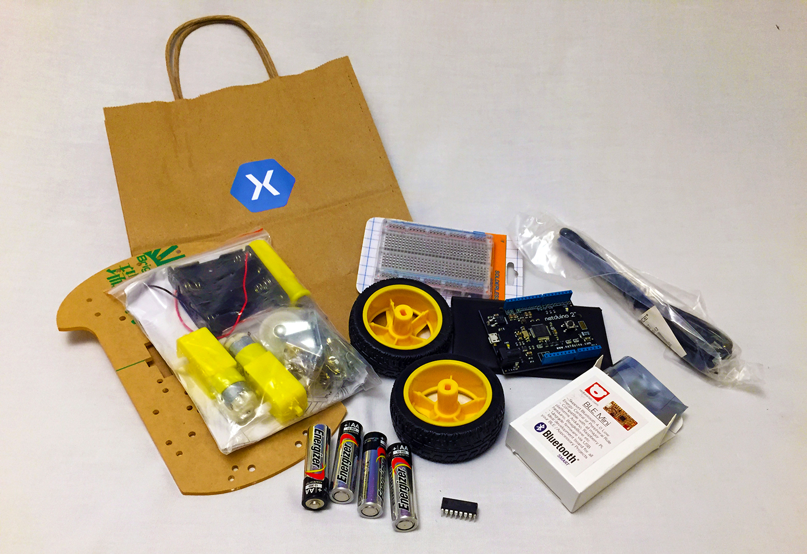

# Monkey.Robotics Darwin Lounge Hacks

The first 60 people who complete all 5 hacks get their own robot kit!

As you complete the hacks, make sure to get your hack checklist signed off by a Xamarin Robotocist!

 1. **Hack 1** - [Drive the Robot with the Robotroller App](1_DriveRobot)
 2. **Hack 2** - [Deploy a First Netduino App](2_DeployFirstApp)
 3. **Hack 3** - [Deploy a First Micro Stack Platform App](3_DeployMicroStackApp)
 4. **Hack 4** - [Add Headlights to the Robot](4_AddHeadlights)
 5. **Hack 5** - [Customize the Robotroller UI with Xamarin.Forms](5_CustomizeRobotrollerUI)
