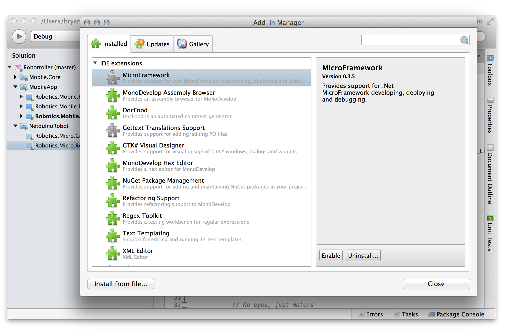

# Setting up your Netduino + Build Environment

The first step in getting started with Xamarin Robotics is to get your Netduino up and running, and getting some test code deployed to it.

In this guide, we're going to go over the installation and requirements for setting up your build environment and hardware.

## Requirements

While Xamarin.Robotics works with both .NET Microframework devices and other peripherals such as BLE enabled sensors, etc., if you want to take advantage of the .NET Microframework portions of the Xamarin.Robotics platform, you'll need either a [Netduino](http://netduino.com/) 2 or 2 Plus running the 4.3.1 firmware. Other Netduinos may work, but we've only tested on the Netduino 2 and 2 Plus.

**Note that firmware updates must be done on a Windows machine. There is currently no way to update the firmware from a Mac.**

**Firmware and Instructions:**

 * [Netduino 2](http://forums.netduino.com/index.php?showtopic=10480)
 * [Netduion 2 Plus](http://forums.netduino.com/index.php?showtopic=10479)
 
If your Netduino isn't running 4.3.1, you will not be able to deploy from a Mac, and your code may not compile on Windows.

### Mac
If you're using a Mac, you'll need to have Xamarin Studio installed, and then you'll need to install the Micro Framework Plug-in. To install:

 1. From the **Xamarin Studio** menu choose **Add-in Manager**, select the **Gallery** tab, and then in the Search, type `MicroFramework`(you may have to click on the Refresh button):
 
 
 2. Click **Install**. The add-in will download and install all the appropriate packages. You will likely have to enter your password up to four times, as it moves files into place.
 
 3. Restart Xamarin Studio.
 
 4. Open the Add-in Manager again, find the MicroFramework extension under **Installed** > **IDE extensions**, select it and click **Enable** to enable the add-in:
 
 
After that, you should be good to go.
 
### Windows

If you're running Windows, you'll need to:

 1. Install either Visual Studio 2012 or [Visual Studio 2012 Express](http://www.microsoft.com/en-us/download/details.aspx?id=34673).
 2. Install the [.NET Micro Framework SDK v4.3 QFE1](http://www.netduino.com/downloads/MicroFrameworkSDK_NETMF43_QFE1.msi).
 3. Install the [Netduino SDK 4.3.1](http://www.netduino.com/downloads/netduinosdk_NETMF43.exe).

**Note, if you want to use Visual Studio 2013, there is experimental support [here](http://forums.netduino.com/index.php?/topic/10201-experimental-visual-studio-2013-support/).**

## Next Steps

Once you have your hardware and development environment configured, it's time to [build and deploy a simple program to your Netduino](FirstMicroApp.md).

