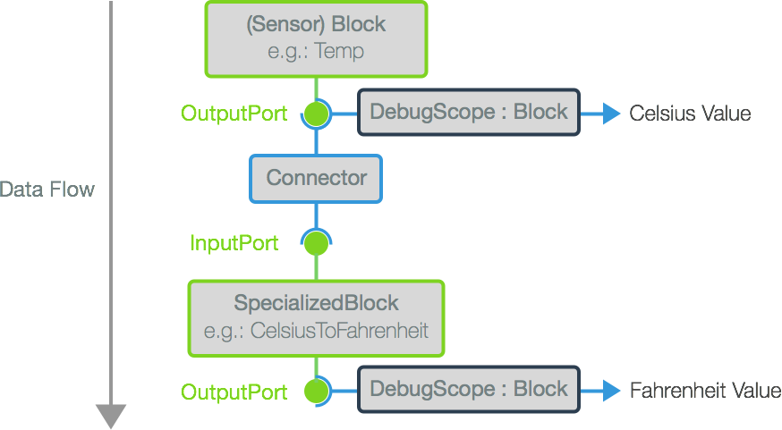

# Getting Started with the Micro Stack

## Setup and Configuration

The first step to using Monkey.Robotics is to setup your hardware, build enivronment, and test your micro-controller out with a simple app.

### 1. [Configuring Your Build Environment and Hardware](ConfiguringBuildEnv.md)

This guide will help you get your development environment and Micro Framework hardware all setup so you can build and deploy project.

### 2. [Creating a First App](FirstMicroApp.md)

After you got your hardware and environment configured, it's time to build a simple app that blinks the onboard LED on your netduino to make sure everything is configured and running properly.

After you've got your first app running, read-on, so you can understand how to create more complex applications.

## Understanding the Micro Stack Architecture and Programing Model

The Micro Stack loosely follows a [Reactive Programming](http://en.wikipedia.org/wiki/Reactive_programming) pattern. This means that instead of an event-driven model (which works well in tradition UI apps), components within any paritcular hardware configuration are actually bound to each other and represented by *Blocks*; such that an output signal from one block is automatically passed to another block.

This reactive pattern works incredibly well for circuits because signals tend to be a constant, rather than periodic events such as a person interacting with a UI. Building with composible blocks allow Micro apps to more closely mimic the composibility of the hardware configurations themselves.

### Types of Blocks

In the Micro Stack, nearly everything is a block. But they generally fall into various categories (which roughly translate to namespaces):

 * **Sensors** - Sensors are peripherals that typically have outputs and are sometimes configurable. Sensors include buttons, light sensors, infrared distancing, accelerometers, compasses, temperature, etc. We have bound many commonly available sensors sold in Maker stores.
 * **Motors** - These include not only the electric motors themselves, but also the drivers such as driver boards, and H-Bridges.
 * **Generators** - These are specialized blocks that genearate signals. For example, there is a sine-wave generator, Pulse-width modulation (PWM) generator, constant generator, etc.
 * **Scopes** - Scopes are blocks that are meant to listen in on signals and do interesting things with the signal. For example, we have a DebugScope which can be configured to sample a signal at specific time intervals and write the signal value out to the debug console.
 * **Specialized Blocks** - Specialized Blocks are blocks that don't fit into the previous categories. Some of them are used for signal transformation; for instance, converting a signal that carries Celsius temperature data into a signal that carries Farenheit temperature data.


### Connecting Blocks

In practice, the way this works is that nearly every thing in the Micro Stack derives from the Block class. A block can have Input and Output ports which are bound to each other via the `ConnectTo()` method. For instance, the following micro framework app binds the *Output* from the Netduino's onboard button to the *Input* of the onboard LED. This results in the LED lighting up when the button is pressed:


```
public class Program
{
	// create our pin references.
	// note, when you create a reference to the onboard button, netduino is 
	// smart enough to not use it as a reset button. :)
	static H.Cpu.Pin buttonHardware = Pins.ONBOARD_BTN;
	static H.Cpu.Pin ledHardware = Pins.ONBOARD_LED;

	public static void Main()
	{
		// Create the blocks
		var button = new DigitalInputPin (buttonHardware);
		var led = new DigitalOutputPin (ledHardware);

		// Connect the outpt of the button to the input of the LED
		button.Output.ConnectTo (led.Input);

		// keep the program alive
		while (true) {
			System.Threading.Thread.Sleep (1000);
		}
	}
}

```

### Advanced Block Usage

Because Blocks are composible, they can be strung together to create complex integrations. When you connect two blocks up, a `Connector` class is created internally that does the plumbing for you, so you don't have to. By connecting these blocks, interesting work can be accomplished easily. For example, let's say we have a temperature sensor that outputs the temperate in Celsius, but we actually want to get the temperature in Fahrenheit. Additionally, we want to add debug scope along the way to see that things are working properly, we would wire things up as follows:



By using this architecture, it also helps us to think of our apps using the same conceptual framework as the underlying circuits themselves.


