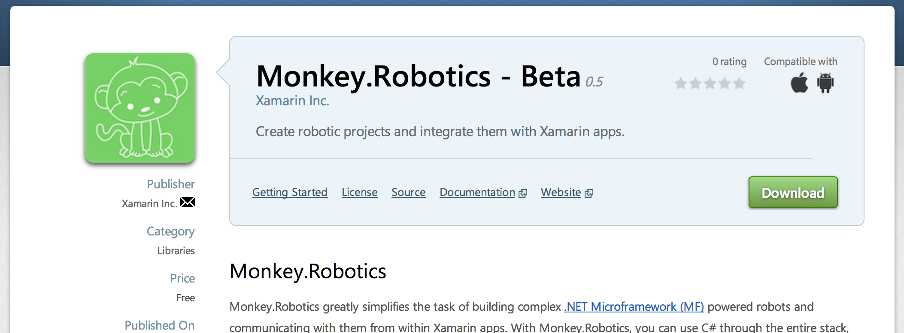
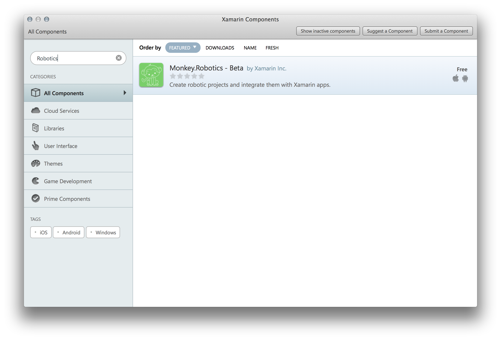

# Getting Started with the Mobile Stack

The Mobile Stack of Xamarin.Robotics makes communication with the Micro Stack easy by providing a cross-platform Bluetooth Low-Energy (BLE) API.


## Installing the Mobile Component

The Mobile Stack can be installed as a [component](https://components.xamarin.com/view/monkey.robotics), available in the Xamarin Component Store:



To install into your app, double click on the **Components** folder and search for `Robotics`. Click on it and then choose **Add to App**.




## Integrating BLE

The following code can be seen in action in the BLE Explorer sample app included in the component. It's also availabe [here](../Sample%20Apps/BLE%20Explorer). The following is an overview of working with the API, but for a full understanding of how to use it, make sure to check out the sample app.

### Get a Reference to the Adapter

In order to connect to BLE devices, the first thing that you'll need to do is get a  reference to the Adapter. The Adapter gives you access to BLE communication functions. A single adapter is used across your entire app, and is available as the static `Current` property on the Adapter class:

```csharp
App.SetAdapter (Adapter.Current);
```

### Enumerating Devices

Once you have your adapter, you can start device scanning via `StartScanningForDevice` and pass an empty GUID if you don't want to scan for any particular device, but instead want to enumerate them all:

```csharp
adapter.StartScanningForDevices(Guid.Empty);

```

### Connecting to a Device

An IDevice reference is passed every time a device is discovered:


```csharp
adapter.DeviceDiscovered += (object sender, DeviceDiscoveredEventArgs e) => {
	Device.BeginInvokeOnMainThread(() => {
		devices.Add (e.Device);
	});
};
```

To connect to that device, simply call `ConnectToDevice` on the adapter and pass the IDevice reference:

```csharp
adapter.ConnectToDevice (device); 
```

### Enumerating Services

Once the Device is connected, you can enumerate the services on it by calling `DiscoverServices`.

```csharp

adapter.DeviceConnected += (s, e) => {
	device = e.Device; // do we need to overwrite this?

	// when services are discovered
	device.ServicesDiscovered += (object se, EventArgs ea) => {
		Debug.WriteLine("device.ServicesDiscovered");
		//services = (List<IService>)device.Services;
		if (services.Count == 0)
			Device.BeginInvokeOnMainThread(() => {
				foreach (var service in device.Services) {
					services.Add(service);
				}
			});
	};
	// start looking for services
	device.DiscoverServices ();

};
```

### Enumerating Characteristics

You can enumerate the characteristics for a service by calling `DiscoverCharacteristics` on the Service itself:

```csharp
// when characteristics are discovered
service.CharacteristicsDiscovered += (object sender, EventArgs e) => {
	Debug.WriteLine("service.CharacteristicsDiscovered");
	if (characteristics.Count == 0)
		Device.BeginInvokeOnMainThread(() => {
			foreach (var characteristic in service.Characteristics) {
				characteristics.Add(characteristic);
			}
		});
};

// start looking for characteristics
service.DiscoverCharacteristics ();

```
