# Assembling the Robot

First step is to assemble the robot chassis.

Your parts should look something like this:

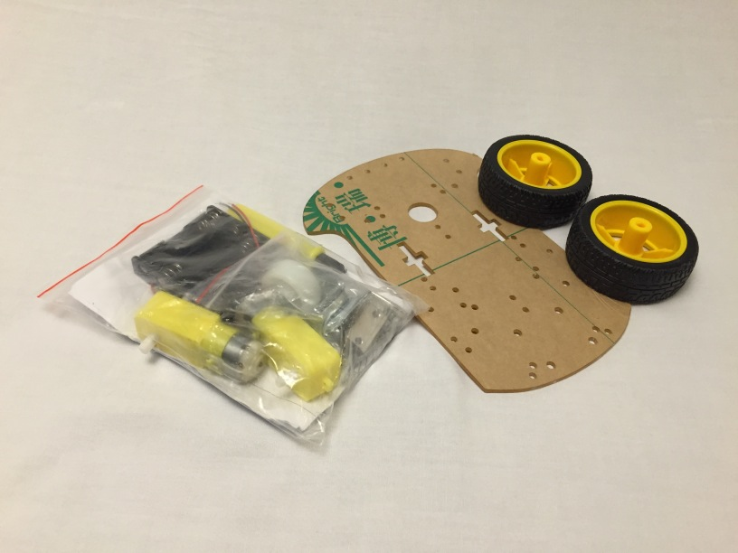

Peel the paper off the laser cut chassis plate (otherwise it'll peel later and your components may fall off):

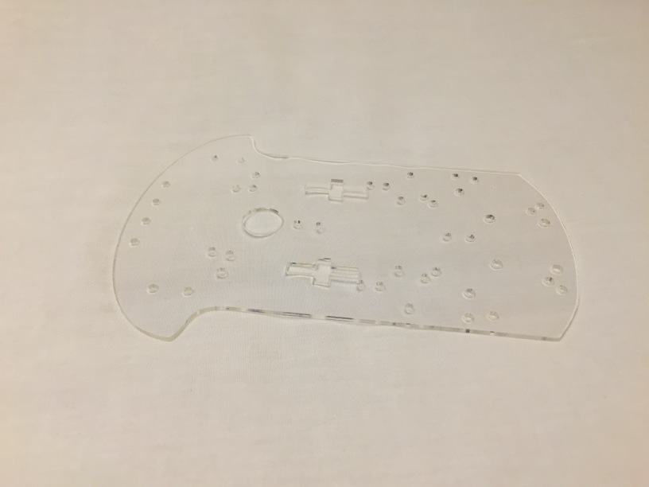

## Step 1: Solder the Motor Wires

Solder a black and a red wire to the flat metal leads coming off each of the motor.  Doesn't matter which wire to which side, you can change where they're plugged in later.

 1. Remove the plastic motor retainers (it may help to use needle-nose pliers to pull them down, off the lip):
 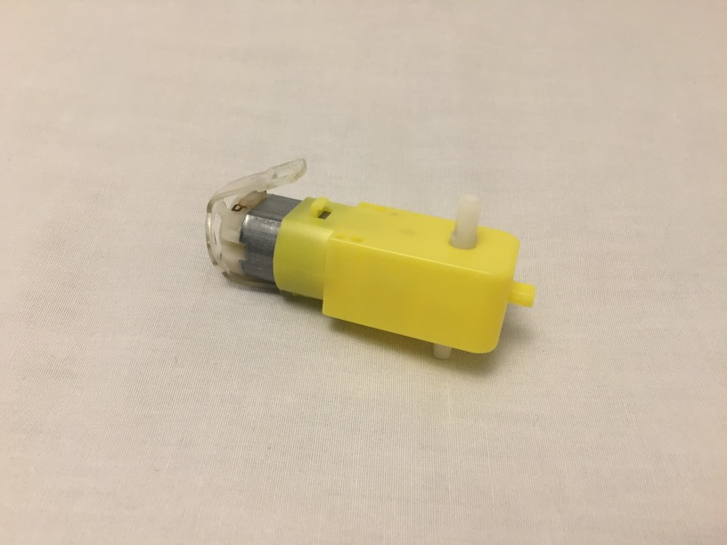 
 2. heat your soldering iron, and tin the tip (you can get soldering iron tip cleaner and tinner at radioshack) 
 3. bend the wire ends in half, put through the leads and clamp shut:
 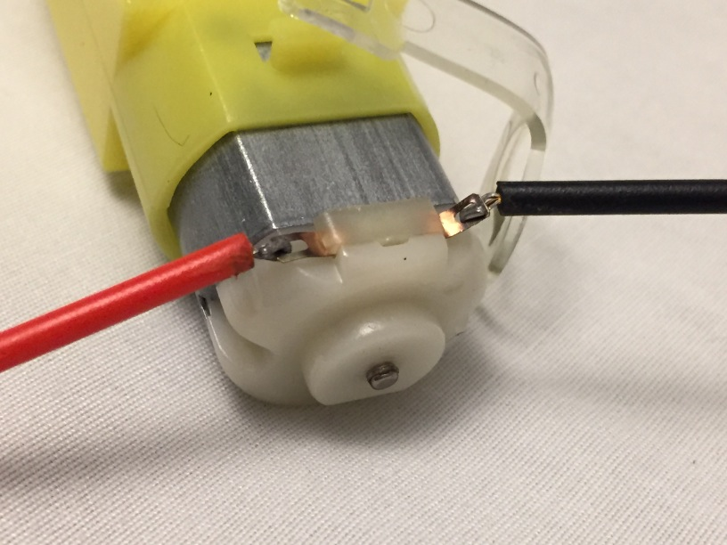 
 4. Hold the iron on the wire + leads for about 5 seconds, and apply solder. After soldering, put the plastic motor retainers back on:
 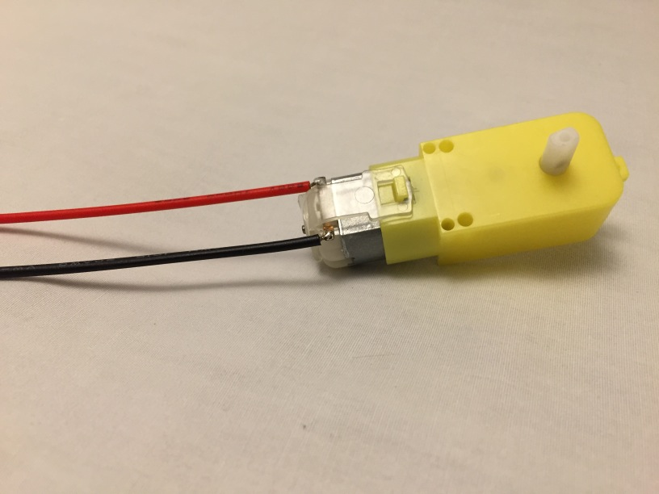 

## Step 2: Add Attachment Plate to Motors

Screw the motor attachment block onto the motor with two of the long bolts. Note that you'll create two of these assemblies, each mirroring each other:

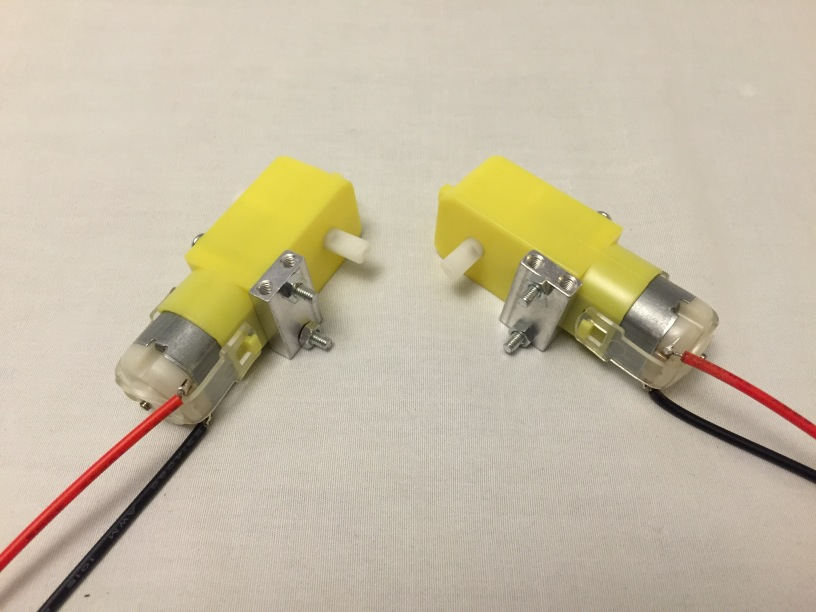 

## Step 3: Attach the Wheels

Push the tire/wheel assembly onto the motor axle (it takes a bit of pressure and finesse). Make sure the wheels are on the opposite side of the attachment plate. The round laser cut speed wheels are optional. You only need them if you want to add a speedometer in the future.

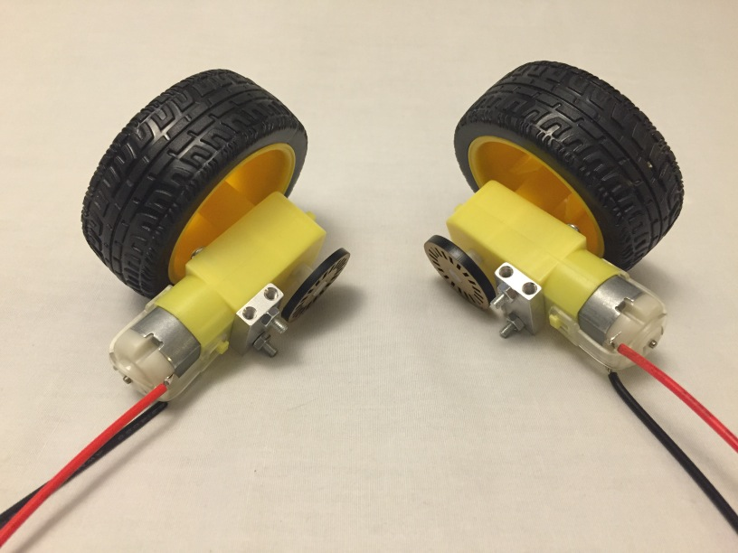 

## Step 4: Bolt the motors to the plate

Use the small bolts to attach the motors to the plate as shown:

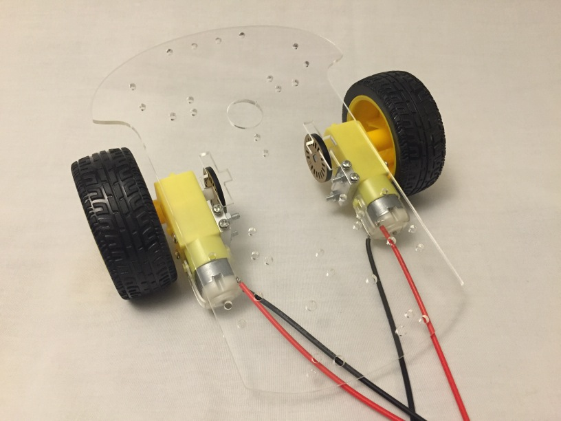 

## Step 5: Run the Motor Wires through the Chassis

Route the motor wires through the chassis plate as shown:

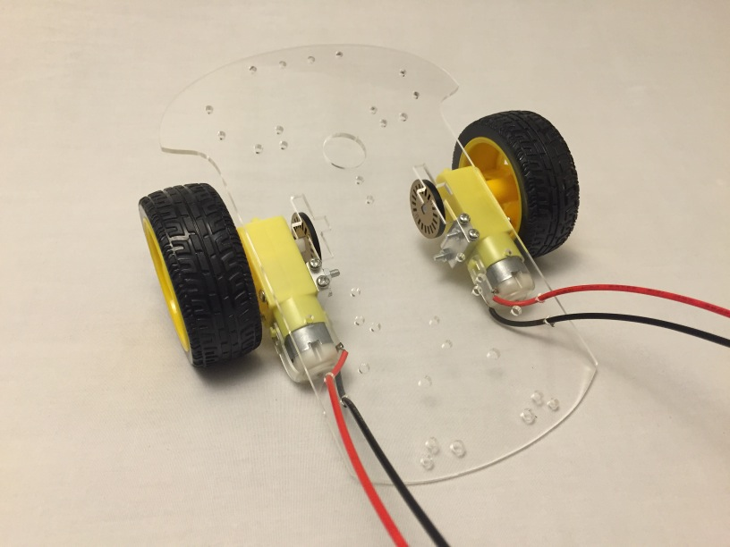 

## Step 6: Attach the Front Wheel

Then, using 4 small bolts and nuts, attach the front wheel to the front of the plate:

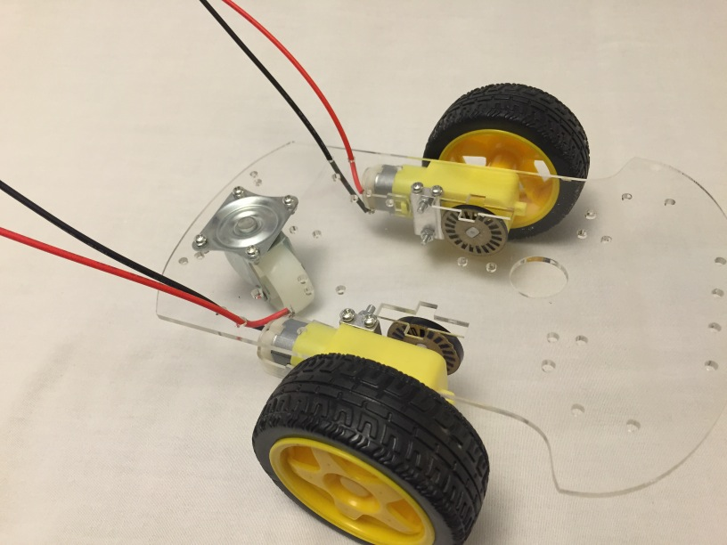 

## Step 7: Put Double-Sided Tape on the Netduino and Battery Pack

This will allow you to attach them to the chassis plate. You may want to put two layers of tape (as shown) to the Netduino to help route the battery pack wires under it later:

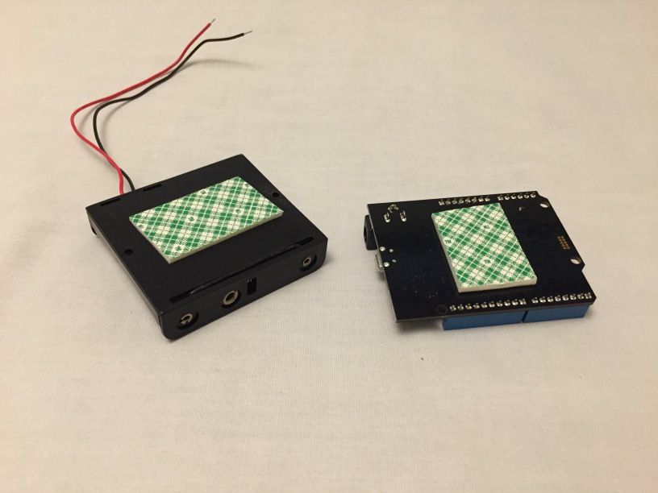 

## Step 8: Attach Breadboard, Netduino and Breadboard to the Chassis Plate

Make sure to run the battery pack wires under the Netduino, and note the orientation of the Netduino relative to the Breadboard.

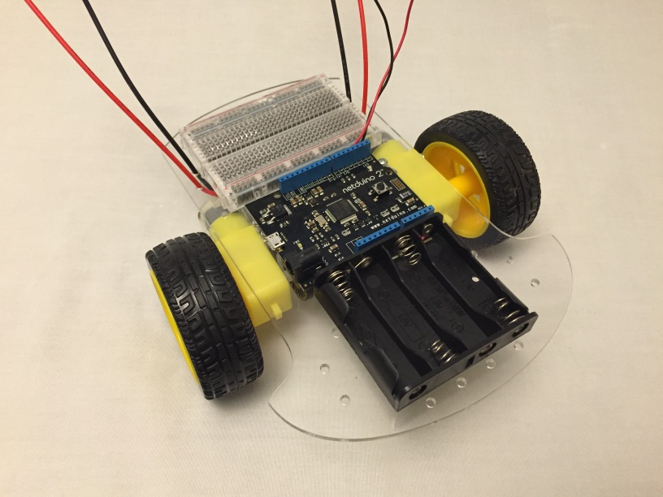 

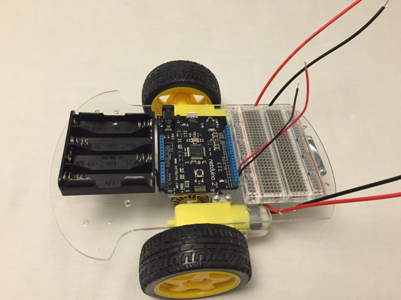 

> Note: you may want to move the Netduino towards the side that doesn't have the USB port so you don't have to take the wheel off to plug a USB cable in. :)

## Step 9: Plug the Battery Leads in

Route the battery leads to the power rail on the bread board and plug the **red wire into the "+" rail** and the **black wire into the "-" rail**:

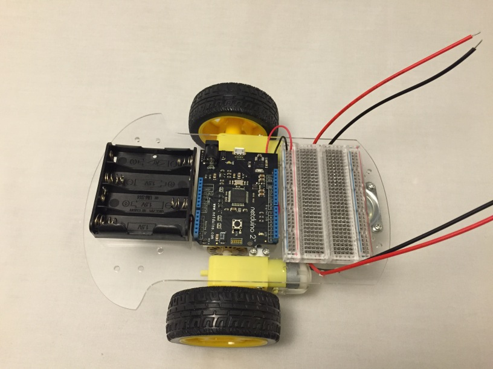 
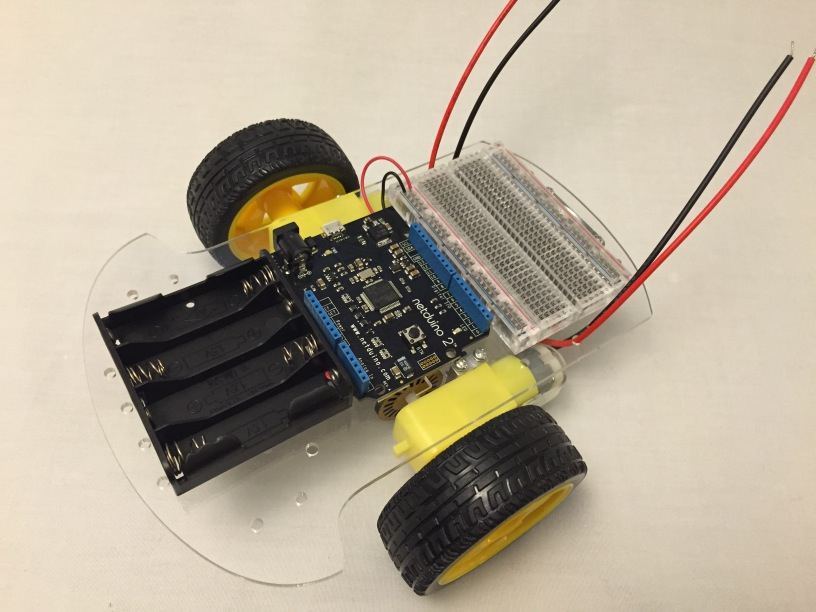 

## Step 9: Add the H-Bridge and the BLE Mini

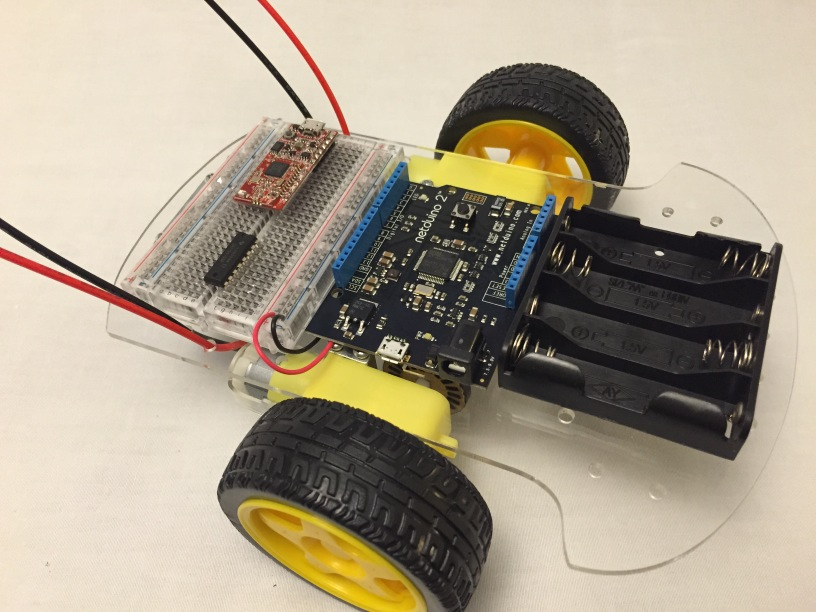 

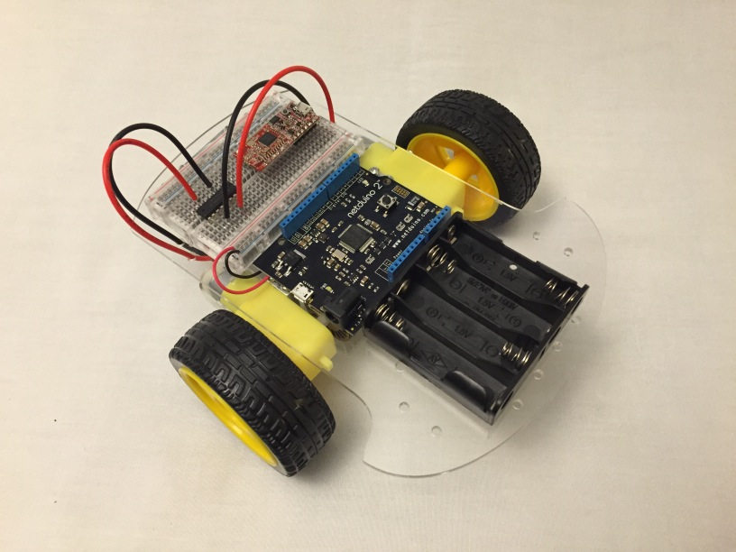 

