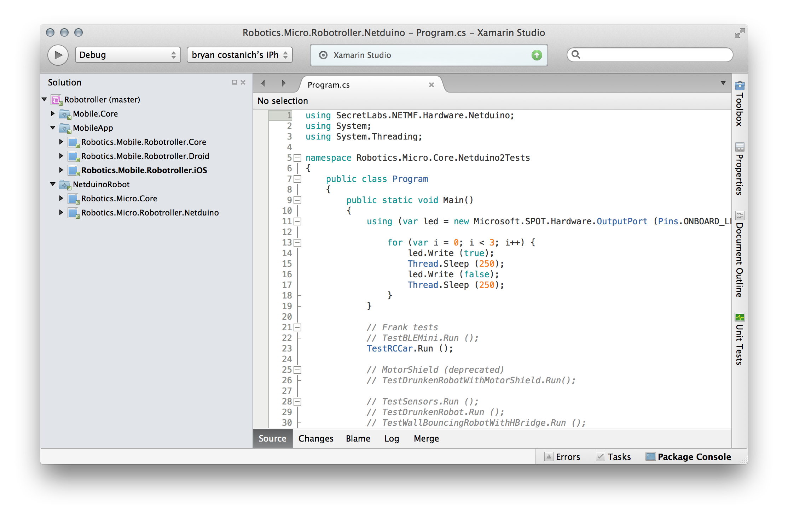
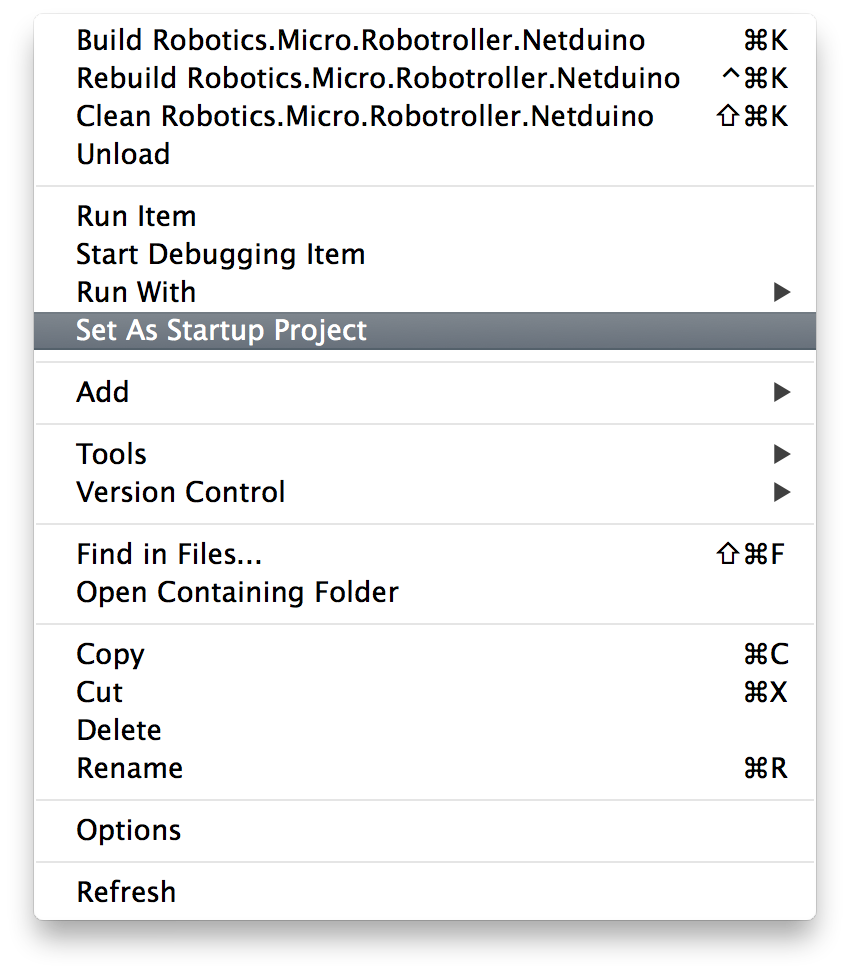

# Deploy the Code

First, open the [Robotroller Solution](../../Sample%20Apps/Robotroller):

## 1 - Deploy the Robot Micro Code

 1. Right-click on the **Robotics.Micro.Robotroller.Netduino** project and select **Set as Startup Project**:
 

 2. Select **Debug** in the build bar, and your **Netduino 2** as the device and hit the **>** button to deploy.

## 2 - Deploy the Mobile App

Expand the **MobileApp** solution folders, and right-click on the platform app (e.g. iOS or Android), Set as Startup Project, and deploy.

> Note: there is currently a bug in the Android app that we're working on, so for right now, only the iOS App works.