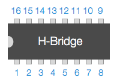
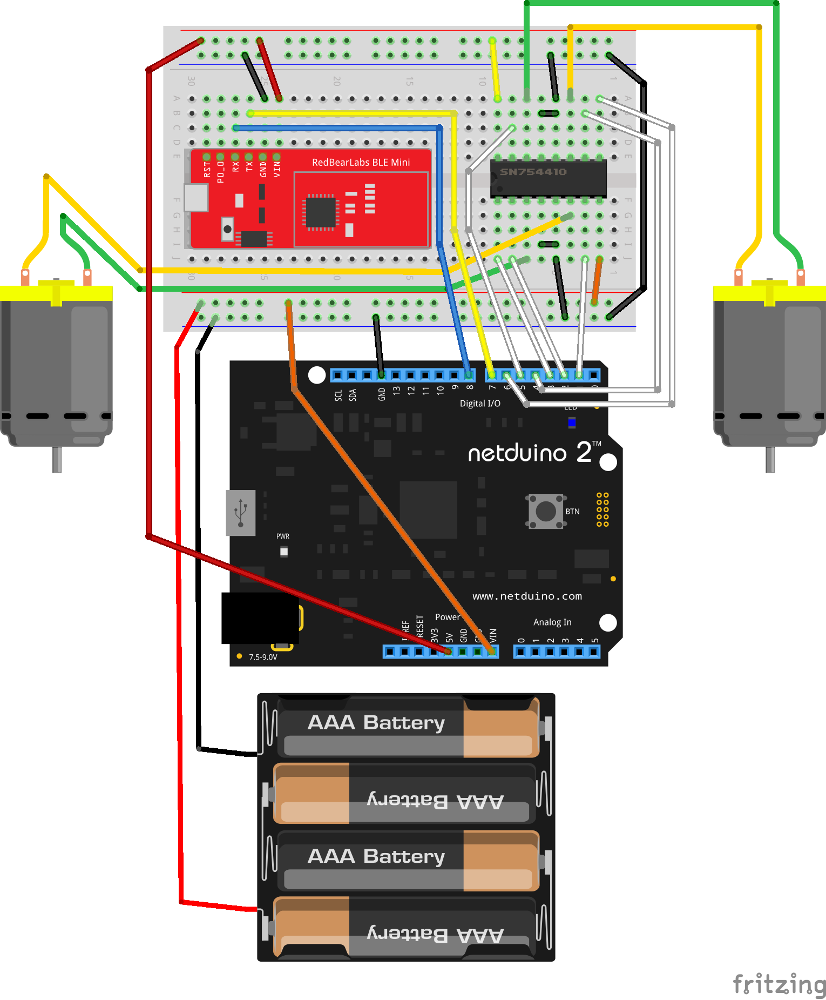
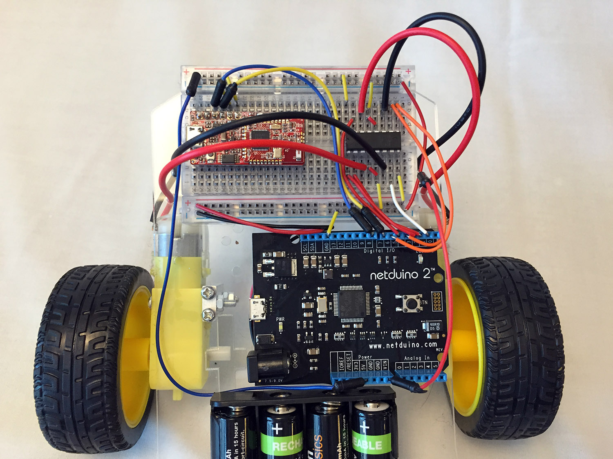

# Wire up the Robot

Wire the Robot as follows:

|Wire Start   | Wire End
|-------------|---------
| Netduino D1 | H-Bridge 7
| Netduino D2 | H-Bridge 2
| Netduino D3 | H-Bridge 1
| Netduino D4 | H-Bridge 10
| Netduino D5 | H-Bridge 15
| Netduino D6 | H-Bridge 9
| Netduino D7 | BLE TX
| Netduino D8 | BLE RX
| BLE GND | Ground (`-`) Rail
| BLE VIN | Breadboard Upper 5V (`+`) Rail
| Netduino GND | Breadboard Ground (`-`) Rail
| Netduino VIN | Breadboard Lower 6V (`+`) Rail
| Netduino 5V | Breadboard Upper 5V (`+`) Rail
| H-Bridge 4, 5, 12, 13 | Ground (`-`) Rails
| H-Bridge 8 | Breadboard Lower 6V (`+`) Rail
| H-Bridge 16 | Breadboard Upper 5V (`+`) Rail
| Breadboard Upper Ground (`-`) Rail | Breadboard Lower Ground (`-`) Rail
| Left Motor | H-Bridge 3, 6
| Right Motor | H-Bridge 11, 14
| Battery Red (`+`) | Breadboard Lower 6V (`+`) Rail
| Battery Black (`+`) | Breadboard Lower Ground (`-`) Rail

Don't worry about getting the motor polarity (`+` and `-`) correct, as you can easily switch them after the robot is turned on and you try to drive it.

> Note that the two power rails are not connected together because they have different voltages. Lower rail has 6V straight from the batteries, which powers the Netduino and Motors (via the H-bridge), and the upper rail has 5V that comes from the Netduino and powers the BLE chip. The Netduino has an onboard voltage regulator that steps down the 6V from the batteries to 5V.

## H-bridge Pinout

Note the rotation of the h-bridge. Pin #1 is just below the notch, and they continue around the chip in a counter-clockwise fashion:

## Wiring Diagram

The correct wiring is illustrated as below:

## Wiring Photo

When complete, the wiring should look something like this:

