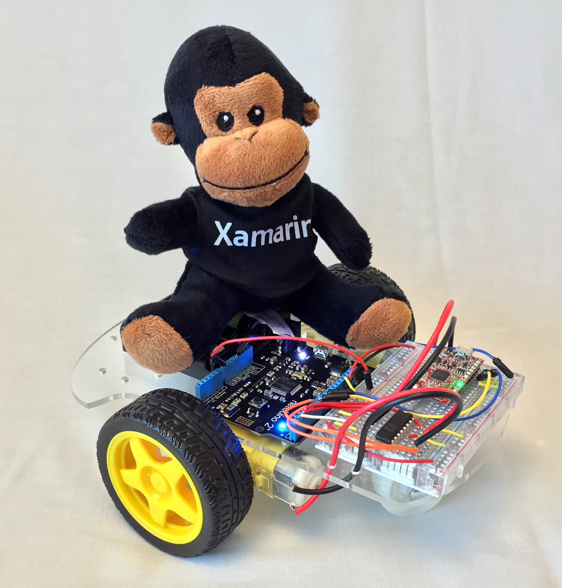

# Build a Robot!

These guides will walk you through building a two wheeled robot that you can remotely control over BLE from a Xamarin app that runs on iOS and Android using the same code base.

These guides assume that you have your [Build Environment and Hardware Configured](../Getting%20Started/ConfiguringBuildEnv.md), and that you're able to successfuly [Deploy an App to your Netduino 2 or 2 Plus](../Getting%20Started/FirstMicroApp.md).

## Requirements

In order to build the Robot above, you'll need the following items. All told, your robot will cost about $75:

 * **2-wheeled Robot Chassis w/Motors** - Just about any 2 wheeled robot chassis with motors and gears will work, but we like [these](http://www.aliexpress.com/item/New-Motor-Smart-Robot-Car-Chassis-Kit-Speed-Encoder-Battery-Box-For-Arduino-Free-Shipping/1924502066.html). They're only $11 and they work well. Spark Fun also makes a [similar robot chassis](https://www.sparkfun.com/products/10825) for $15, but the battery holder is difficult to access, otherwise, it's also very nice.
 * **[Netduino 2](http://www.amazon.com/Secret-Labs-Netduino-2/dp/B009QOWOFU/ref=sr_1_2?ie=UTF8&qid=1411525496&sr=8-2&keywords=Netduino+2)** - From Secret Labs, the Netduino is a programmable micro controller that runs the .NET Micro Framework.
 * **[BLE Mini](http://redbearlab.com/blemini/)** - From Redbear Labs. Used to communicate with the robot from Xamarin.iOS and Xamarin.Android.
 * **[400 Point Breadboard](http://www.amazon.com/s/ref=nb_sb_noss?url=search-alias%3Daps&field-keywords=400+point+breadboard)** - The breadboard is where our electronics will all get connected. It has holes in it to put chips, sensors, wires, etc., into.
 * **[Breadboard Wiring Kit](http://www.amazon.com/s/ref=nb_sb_noss?url=search-alias%3Daps&field-keywords=140+piece+jumper+kit)** - Any wiring kit will work, but we especially like these. You may also want to get some [male-to-male flexible jumper wires](http://www.amazon.com/Wosang-Solderless-Flexible-Breadboard-Jumper/dp/B005TZJ0AM/ref=sr_1_1?ie=UTF8&qid=1411525786&sr=8-1&keywords=breadboard+wires). 
 * **[Dual H-Bridge Chip](http://www.amazon.com/gp/product/B00GX38FGY/ref=oh_aui_detailpage_o00_s00?ie=UTF8&psc=1)** - Used to power the motors, H-bridges are simple chips that allow you to control motors with external power, so you don't burn out your Netduino trying to drive them with that. :) You can also [build an H-bridge with some simple components](http://www.robotroom.com/BipolarHBridge.html), but buying a chip is easier and will likely cost about the same.
 * **iOS or Android Device w/BLE Support** - If using an iOS device, you'll need an iPhone 4 or later. If using an Android Device, you'll want to make sure that it has BLE support and is running at least Android v4.3.

## Instructions

Make sure you [have you development and build environment setup](../../Getting%20Started/Micro_Stack/ConfiguringBuildEnv.md), and then follow teh guides below to get this thing up and running!

 * **Step 1** - [Assemble the Robot Chassis](AssembleChassis/Readme.md)
 * **Step 2** - [Wire up the Robot](Wiring/Readme.md)
 * **Step 3** - [Deploy the Robot Code](Deploy/)
 * **Step 4** - [Drive the Robot!](https://vimeo.com/108180270)
