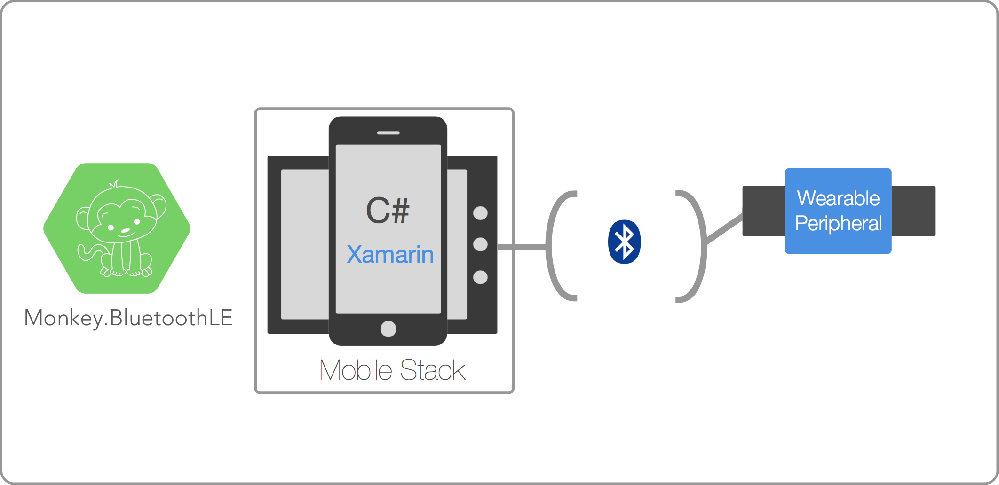
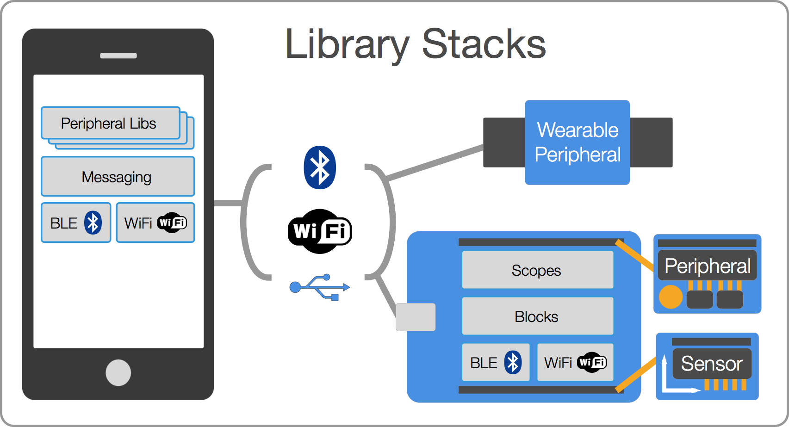

# Monkey.BluetoothLE - Beta

Monkey.BluetoothLE greatly simplifies the task of using BluetoothLE communications in Xamarin apps.

### Beta

> Please Note: Monkey.BluetoothLE is still a beta/work in progress and is not officially supported by Xamarin. It's a passion project put together by folks that love C# and Robotics. We're working on the docs as you read this. If you run into any issues, please file them [on GitHub](https://github.com/xamarin/Monkey.Robotics/issues). Thanks for trying it out!

## Overview
 
The _Mobile Stack_ is built in C# and runs on iOS, Android, and UWP via the [Xamarin platform](http://xamarin.com) and contains features for communicating with IoT devices and wearables (such as health monitoring devices) via BluetoothLE.

The following diagram illustrates the topology of the entire stack:

### Mobile Stack

The Mobile stack consists of three different parts:

 * **Low-level Bluetooth LE (BLE) API** - A cross-platform API (iOS and Android only right now) that supports communicating with BLE devices.
 * **Low-Level Wifi API** - A cross-platform API (iOS and Android only right now) that supports connecting to WiFi enabled devices. Note that the WiFi API is still in progress.
 * **Messaging Framework** - A high-level cross-platform protocol for messaging peripherals via WiFi or BLE.
 * **Peripheral Libraries** - Strongly typed libraries for communicating with various vendor-specific peripherals such as health monitoring devices, smart watches, and the like.

# Documentation and Samples

## [API Documentation](API%20Docs/)

Check out the [API Documentation](API%20Docs/) for reference and API browsing.

## Samples

* [Bluetooth Browser](https://github.com/conceptdev/xamarin-forms-samples/tree/master/BluetoothTISensor) using a _TI SensorTag_.

* [HeartRateMonitor](https://github.com/conceptdev/xamarin-forms-samples/tree/master/BluetoothHeartRateMonitor) built in Xamarin.Forms.

# Authors
Bryan Costanich, Frank Krueger, Craig Dunn, David Karlas, Oleg Rakhmatulin, Adrian Stevens

